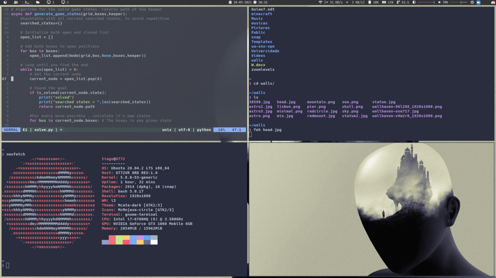

# `[tiago] ~/`

### What's being used:
- [i3-gaps WM](https://github.com/Airblader/i3)
- [polybar](https://github.com/polybar/polybar)
- [rofi](https://github.com/davatorium/rofi)
- [picom](https://github.com/yshui/picom)
- [redshift](https://github.com/jonls/redshift)
- [bash-it](https://github.com/Bash-it/bash-it) config
- [GTK3 Theme](https://www.gnome-look.org/p/1381832/) (not included)

 

### How it looks:

