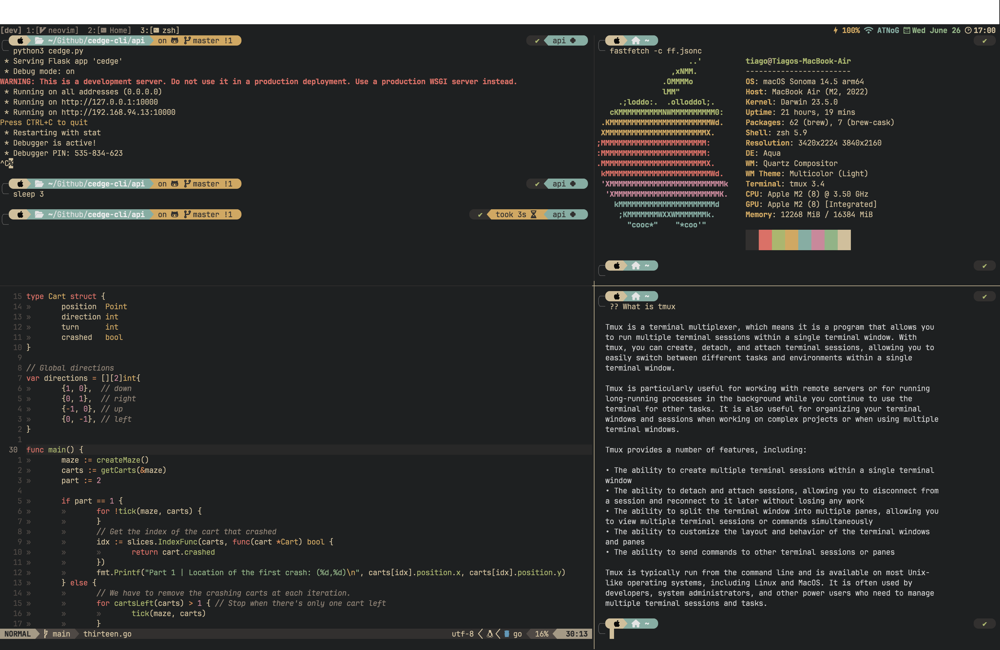

# `[tiago] ~/`

### How it looks:

### What's being used:
- IDE/Dev environment: [neovim](https://neovim.io)
- Neovim Initial Setup: [Kickstart](https://github.com/nvim-lua/kickstart.nvim), but it is now [modularized](https://github.com/dam9000/kickstart-modular.nvim)
- Terminal: [Ghostty](https://github.com/ghostty-org/ghostty)
- Terminal Multiplexer: [Tmux](https://github.com/tmux/tmux)
- Terminal Colorscheme (ported): [Gruvbox Material](./.config/ghostty/config)
- Neovim Colorscheme: [Gruvbox Material](https://github.com/f4z3r/gruvbox-material.nvim)
- Zsh Theme: [powerlevel10k](https://github.com/romkatv/powerlevel10k)

### Notes:

#### My config is heavily influenced by [rwxrob](https://www.youtube.com/@rwxrob)!

Because of it, I'm starting to have a more terminal-centric workflow. I can do quick internet searches from the terminal with lynx. I've also implemented an [AI query](https://groq.com) into
my terminal via the alias `??`, which allows me to communicate with an LLM very fast and get the answers I want even faster. AI is inevitable, get good or get left behind. Don't use it as a substitute to knowing the basics/fundamentals of anything, but *DO USE IT* as a personal assistant, 
a Google search results formatter and aggregator, with the obvious grain of salt, like any other information that's on the Internet.

- No tiling window manager. I only tile the terminal and tmux is the best for that.
- No bloated tmux conf. Only relies on a couple of simple scripts, and the remote version has 0 plugins.
- Ghostty because of the native automatic background detection for macOS.
- p10k because its pretty
- The `/scripts` folder contains some personal scripts that are in my `PATH` and some are called by tmux.
