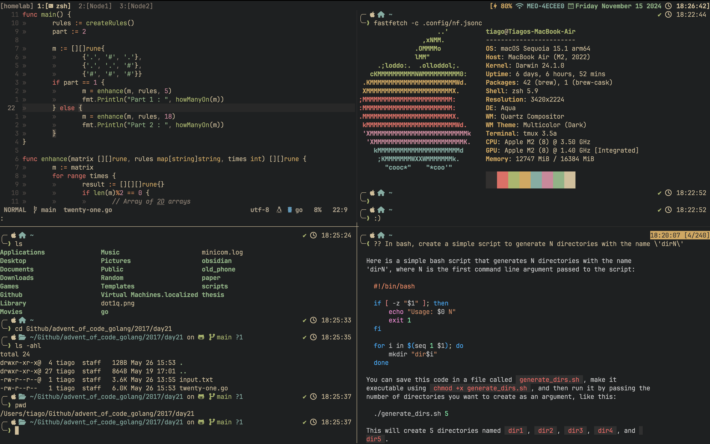

# `[tiago] ~/`

### What's being used:
- IDE/Dev environment: [neovim](https://neovim.io)
- Neovim Initial Setup: [Kickstart](https://github.com/nvim-lua/kickstart.nvim)
- Window Manager: [yabai](https://github.com/koekeishiya/yabai)
- Navigation Hotkeys: [skhd](https://github.com/koekeishiya/skhd)
- Terminal: [Iterm2](https://iterm2.com)
- Terminal Colorscheme: [Gruvbox Dark](https://iterm2colorschemes.com)
- Neovim Colorscheme: [No Clown Fiesta](https://github.com/aktersnurra/no-clown-fiesta.nvim/)

### How it looks:

